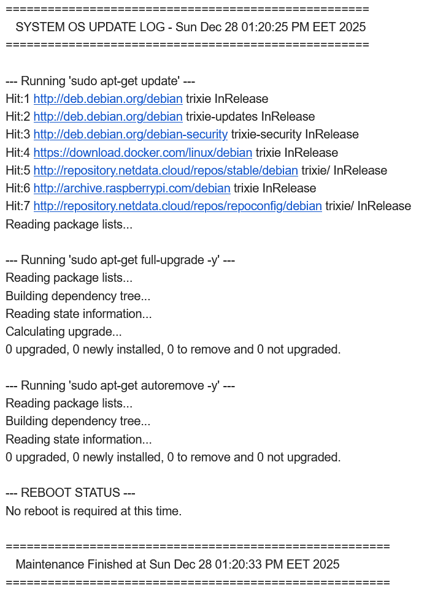
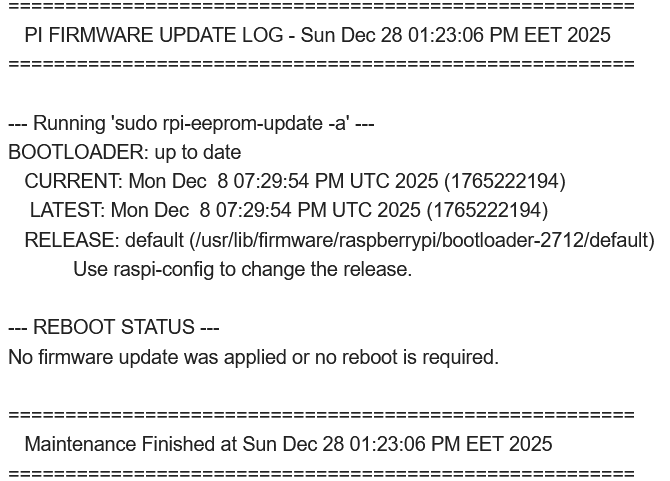
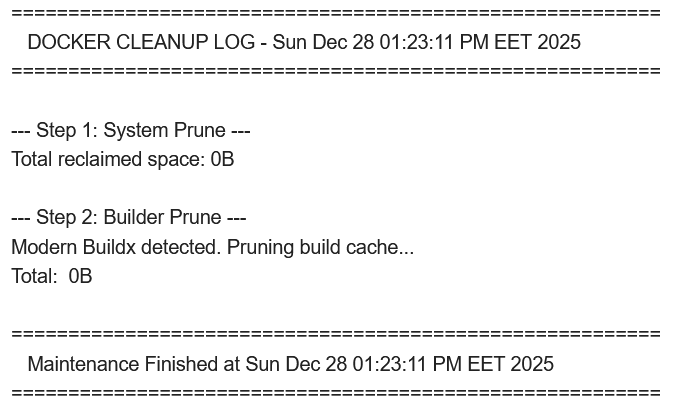
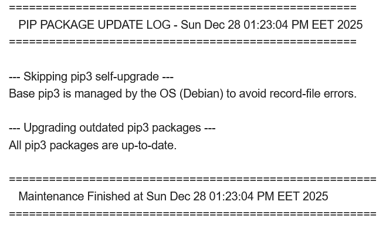
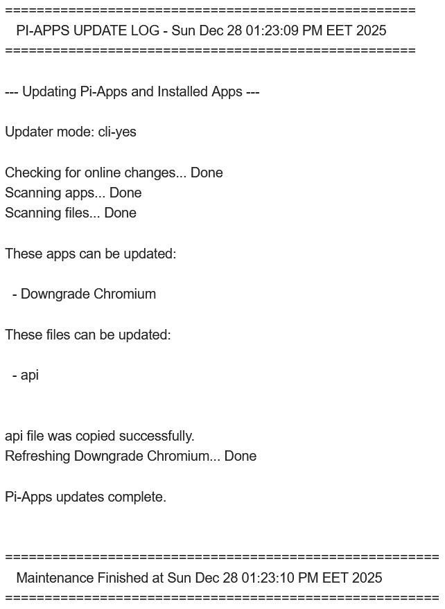

<p align="center">
  
</p>

[](https://github.com/ventura8/Synology-SRM-Bing-Wallpaper-Auto-update) 

# **Raspberry Pi Maintenance & Automation Suite**

A collection of Bash scripts for **Raspberry Pi OS, Xubuntu, and Debian-based systems** to automate system updates, application management, firmware maintenance, and Docker maintenance with automated email reporting via Gmail.  

> [!IMPORTANT]  
> This project requires `ssmtp` to be installed and configured with a Google App Password to send email reports. Standard Gmail passwords will not work due to Google's security policies.

## **🚀 Quick Install (One-Liner)**

Open your terminal and run the following command to install the script automatically:  

```bash
wget -qO- https://raw.githubusercontent.com/ventura8/Raspberry-Pi-Maintenance-Automation-Suite/main/install.sh | bash

```


## **📸 Screenshots**

| OS Update | Firmware Update | Docker Cleanup | Pip Update | Pi-Apps Update |
| :---- | :---- | :---- | :---- | :---- |
|  |  |  |  |  |

## **✨ Features**

* **Interactive Manager UI:** Run the installer anytime to view status, toggle tasks, or change schedules via a menu.
* **Customizable Scheduling**: Interactively choose which tasks to run and when (keep defaults or set custom cron times).  
* **Re-Run Capable**: Run the installer again at any time to update scripts, reconfigure email, or change your schedule.
* **Automated Email Reporting**: Receive detailed logs of every maintenance task directly in your inbox via SSMTP.  
* **Intelligent Reboot Detection**: Automatically detects when OS or Firmware updates require a system restart and schedules it safely.  
* **Full Distribution Updates**: Uses `full-upgrade` to intelligently handle kernel and firmware dependency changes for maximum stability.  
* **Modern Python Support**: Bypasses PEP 668 "Externally Managed Environment" restrictions safely for global package updates.  
* **Docker Resource Optimization**: Automatically detects and uses `buildx` if available for modern cache pruning; otherwise falls back to legacy builder cleanup.
* **Zero-Touch Maintenance**: Uses non-interactive flags across all scripts to ensure updates never hang waiting for user input.
* **Cross-Platform Support**: Automatically adapts to Raspberry Pi OS or generic Debian/Ubuntu systems, supporting firmware updates via `fwupd` on standard Linux hardware.
* **Samsung SSD Firmware Updates**: Automatically detects Samsung NVMe SSDs and updates firmware using LVFS or Samsung's official firmware images.
* **Automatic Dependency Installation**: Critical update scripts automatically check for and install missing system dependencies (like `rpi-eeprom-update`, `fwupd`, `nvme-cli`, and `ssmtp`) to ensure zero-touch maintenance across different environments.
* **Self-Healing Updates**: The suite tracks its own version (via GitHub commit hash) and automatically updates all local scripts when a new version is released on the `main` branch.
* **Automated Configuration**: The installer handles dependency installation, SSMTP configuration, and user aliasing (revaliases) automatically.

## **📄 Script Descriptions**

### **1\. System OS Update (`update_pi_os.sh`)**

Automates the standard Raspberry Pi OS maintenance workflow. It refreshes the package list, upgrades all installed software, and removes obsolete dependencies. It uses `full-upgrade` to handle kernel dependencies and automatically detects if a reboot is required.

* **Commands:** `apt-get update`, `apt-get full-upgrade`, `apt-get autoremove`.

### **2\. Pi Firmware Update (`update_pi_firmware.sh`)**

Checks for and applies updates to the system firmware. On **Raspberry Pi OS**, it targets the bootloader (EEPROM) for Pi 4/5. On **other Linux distributions** (e.g., Xubuntu, Debian), it uses **`fwupd`** to manage firmware updates for supported hardware.

* **Commands:** `rpi-eeprom-update -a` or `fwupdmgr update -y`.

### **3\. Python Pip Update (`update_pip.sh`)**

Ensures your global Python environment stays current. It upgrades globally installed packages using the `--break-system-packages` flag and suppresses non-critical deprecation warnings. It intelligently skips the base `pip` upgrade to avoid conflicts with the Debian package manager.

* **Note:** This script is automatically disabled/hidden on non-Raspberry Pi systems to protect desktop environments from potential breakage.

* **Commands:** `pip3 list --outdated`, `pip3 install --upgrade --break-system-packages`.

### **4\. Pi-Apps Manager Update (`update_pi_apps.sh`)**

Specifically for users of the Pi-Apps community store. It uses the unified `cli-yes` mode to update the Pi-Apps manager and all installed applications in a single pass, with aggressive log cleanup for readable emails.

* **Commands:** `updater cli-yes`.

### **5\. Docker System Cleanup (`docker_cleanup.sh`)**

A cleanup utility for Docker users. It reclaims disk space by removing stopped containers, unused networks, and dangling images. It includes intelligent logic to prune the build cache using the modern `buildx` plugin if installed, falling back to the standard `builder prune` if not.

* **Commands:** `docker system prune -f --volumes`, `docker buildx prune --force` (or `docker builder prune -f`).

### **6\. Samsung SSD Firmware Update (`update_samsung_ssd.sh`)**
 
 Automatically checks for and applies firmware updates for Samsung NVMe SSDs. It uses a two-tier approach:
 
 1. **Primary (LVFS):** Uses `fwupdmgr` to check for updates via the Linux Vendor Firmware Service (Stable Channel).
 2. **Fallback (Official Samsung):** If LVFS doesn't detect the SSD, it dynamically scrapes Samsung's official firmware page, downloads the appropriate ISO, extracts the `fumagician` update tool, and applies the firmware.
 
 **Supported Models:** 9100 PRO, 990 PRO/EVO/EVO Plus, 980 PRO/980, 970 EVO Plus/EVO/PRO, 960 PRO/EVO, 950 PRO.
 
 **Safety Note:** This script explicitly uses stable firmware channels only. It does not enable `lvfs-testing` to prevent beta firmware installation.
 
 * **Commands:** `fwupdmgr update -y --no-reboot`, `nvme-cli`, `fumagician`.

### **7\. Self-Update Service (`update_self.sh`)**
 
 Checks the GitHub repository for updates to the automation suite itself. If a new commit is found on the `main` branch, it automatically downloads the latest versions of all scripts and updates the local installation.
 
 * **Commands:** `curl` (GitHub API), `install.sh`.

## **📅 Automation Schedule (Crontabs)**

The installer configures two separate crontabs to ensure proper permissions:

### **Root Crontab (`sudo crontab -e`)**

* **Firmware Update**: 2:00 AM on the 1st of every month.  
* **System OS Update**: 3:00 AM every Sunday.  
* **Python Pip Update**: 4:00 AM every Sunday.  
* **Docker Cleanup**: 4:20 AM every Sunday.
* **Samsung SSD Firmware Update**: 4:30 AM every Sunday.
* **Self-Update Service**: 1:00 AM every Sunday.

### **User Crontab (`crontab -e`)**

* **Pi-Apps Update**: 5:00 AM every Sunday (Runs as local user to maintain file ownership).

## **🔑 Prerequisites**

Before running the installer, you need to generate a Google App Password:

1. Go to your [Google Account Security Settings](https://myaccount.google.com/security).  
2. Enable **2-Step Verification** if it is off.  
3. Search for **App Passwords** in the search bar.  
4. Create a new one (e.g., "Raspberry Pi") and keep the **16-character code** ready.

## **🛠️ Installation & Removal**

### **One-Line Installer**

The installer handles dependency installation (`ssmtp`, `mailutils`), email configuration, script setup, and crontab scheduling. Run the following command and follow the prompts:

1. Run the installer:

```bash
curl -sSL https://raw.githubusercontent.com/ventura8/Raspberry-Pi-Maintenance-Automation-Suite/main/install.sh | bash
```

2. Follow the on-screen prompts to enter your **Gmail Address** and **App Password**.

*The script will automatically configure `/etc/ssmtp/ssmtp.conf` and `/etc/ssmtp/revaliases` to ensure emails are sent correctly and securely.*

### **Changing Settings**

1. The Manager Menu

Once installed, running the command above launches the main interface:

```bash
   Raspberry Pi Maintenance Suite Manager
   ======================================
   1. Configure Email Settings
   2. View Current Email Config
   3. Manage Tasks & Schedules (Enable/Disable)
   4. Force Update Scripts (from GitHub)
   5. Uninstall Suite
   0. Exit
```

2. Task Status Manager

Select Option 3 to see a live status dashboard of your scheduled tasks:

```bash
   ID  Task Name            Status     Human Time           Cron Raw       
   ------------------------------------------------------------------------
   1   System OS Update     ENABLED    Weekly Sun @ 03:00   0 3 * * 0      
   2   Firmware Update      ENABLED    Monthly 1 @ 02:00    0 2 1 * *
   3   Python Pip Update    ENABLED    Weekly Sun @ 04:00   0 4 * * 0      
   4   Docker Cleanup       DISABLED   -                    -              
   5   Pi-Apps Update       ENABLED    Weekly Sun @ 05:00   0 5 * * 0
   6   Samsung SSD Update   ENABLED    Weekly Sun @ 04:30   30 4 * * 0
```

### **One-Line Uninstaller**

Removes all scheduled cron jobs and deletes the installation directory.

```bash
curl -sSL https://raw.githubusercontent.com/ventura8/Raspberry-Pi-Maintenance-Automation-Suite/main/uninstall.sh | bash
```

## **🛠️ Manual Installation**

### **1\. Install Mail Utilities**

Run the following commands to install the necessary packages:  

```bash
sudo apt-get update  
sudo apt-get install ssmtp mailutils
```

### **2\. 🔑 Configuration Requirement: Configure SSMTP & Gmail**

To allow your Raspberry Pi to send emails, you must configure the `ssmtp.conf` file and set up a Google App Password.

#### **A. Generate a Google App Password**

1. Go to your [Google Account Settings](https://myaccount.google.com/).  
2. Navigate to **Security**.  
3. Ensure **2-Step Verification** is enabled (this is required).  
4. Search for or click on **App Passwords**.  
5. Select **Mail** for the app and **Other (Custom name)** for the device (e.g., "Raspberry Pi").  
6. Copy the generated **16-character code**.

> [!TIP]
> Refer to `ssmtp.conf.example` for the template

> [!IMPORTANT]
> Ensure `AuthPass` is your 16-character code.


#### **B. Edit the Configuration File**

Open the `ssmtp` configuration file:  

```bash
sudo nano /etc/ssmtp/ssmtp.conf
```

Use the following configuration, replacing the placeholders with your actual details:

```bash
root=your_email@gmail.com  
mailhub=smtp.gmail.com:587  
AuthUser=your_email@gmail.com  
AuthPass=your_16_character_app_password  
UseSTARTTLS=YES  
UseTLS=YES  
FromLineOverride=YES  
hostname=raspberrypi
```

#### **C. Edit the Revaliases File**

Open the `revaliases` configuration file:  

```bash
sudo nano /etc/ssmtp/revaliases
```

Use the following configuration, replacing the placeholders with your actual details:

```bash
root:your_email@gmail.com:smtp.gmail.com:587
your_user:your_email@gmail.com:smtp.gmail.com:587
```

#### **D. Set Secure Permissions**

Since this file contains your app password, it is critical to restrict access:  
\# Set ownership to root and the mail group  

```bash
sudo chown root:mail /etc/ssmtp/ssmtp.conf
```

\# Allow only root to read/write, and the mail group to read

```bash
sudo chmod 640 /etc/ssmtp/ssmtp.conf
```

\# Add your local user to the mail group

```bash
sudo usermod -a -G mail $(whoami)
```

> [!TIP]  
> You may need to log out and back in for the group changes to take effect.

#### **D. Test the Configuration**

Verify that the email system is working by sending a test message:

```bash
echo "Test text from Raspberry Pi" | mail -s "Test Subject" your_email@gmail.com
```

### **3\. Setup Scripts**

Clone this repo and make the scripts executable:  

```bash
chmod +x *.sh
```

## **📅 Manual Automation (Cron Jobs)**

Automation is split between the **Root** user (for system tasks) and your **Local** user (for app-specific tasks).

### **1\. Root Crontab (`sudo crontab -e`)**

These scripts manage system-wide software, firmware, and global Python libraries.

```bash
# 2:00 AM - Pi Firmware Update (Monthly)
0 2 1 * * /home/pi/update_pi_firmware.sh

# 3:00 AM - System OS Update  
0 3 * * 0 /home/pi/update_pi_os.sh

# 4:00 AM - Python Pip Update (Global)
0 4 * * 0 /home/pi/update_pip.sh

# 4:20 AM - Docker Cleanup  
20 4 * * 0 /home/pi/docker_cleanup.sh
```

### **2\. User Crontab (`crontab -e`)**

This script must run as your normal user because Pi-Apps resides in your home directory. Running this as root could lead to permission conflicts.

```bash
# 5:00 AM - Pi-Apps Manager Update  
0 5 * * 0 /home/pi/update_pi_apps.sh
```

> [!NOTE]  
> Ensure you replace `/home/pi/` with the actual absolute path where you stored the scripts.

## **⚠️ Troubleshooting**

* **Permission Denied:** Ensure you are running system update scripts as root (via cron or sudo). Note that `update_pi_apps.sh` should **not** run as root.  
* **Authorization Failed:** If you receive a "535 5.7.8" error, double-check your App Password and ensure 2-Step Verification is active on your Google account.  
* **Log Check:** Check `/var/log/syslog` for detailed SSMTP error messages.
